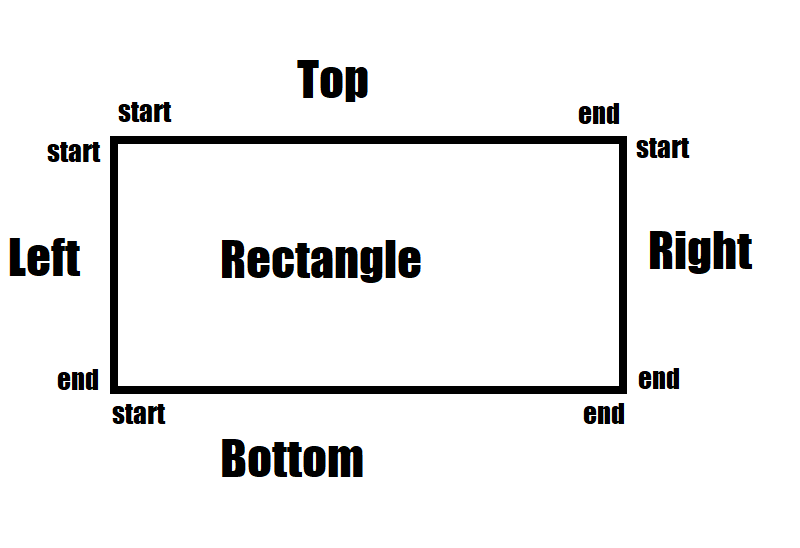
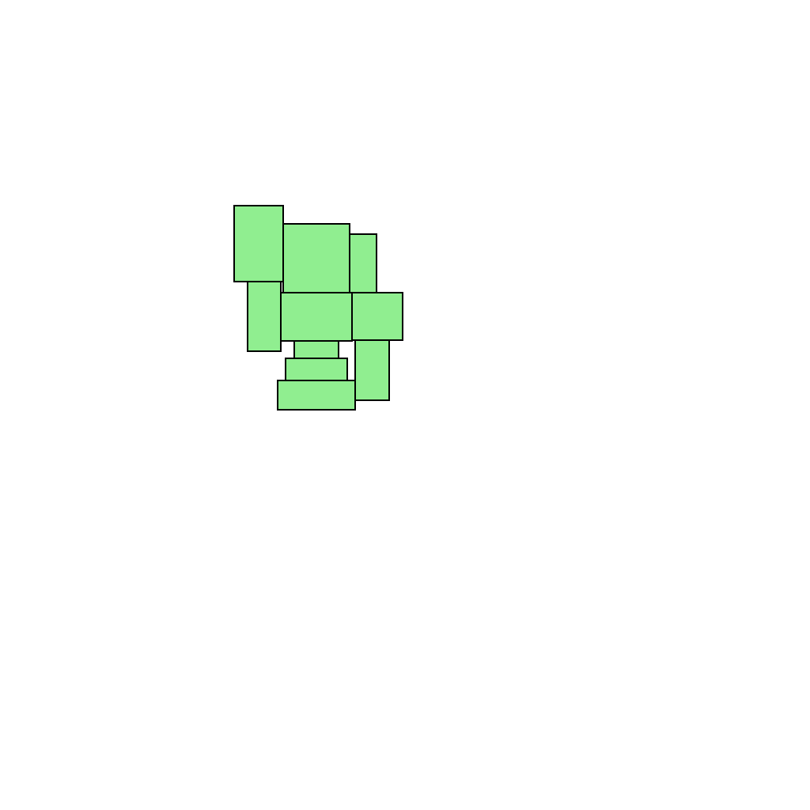
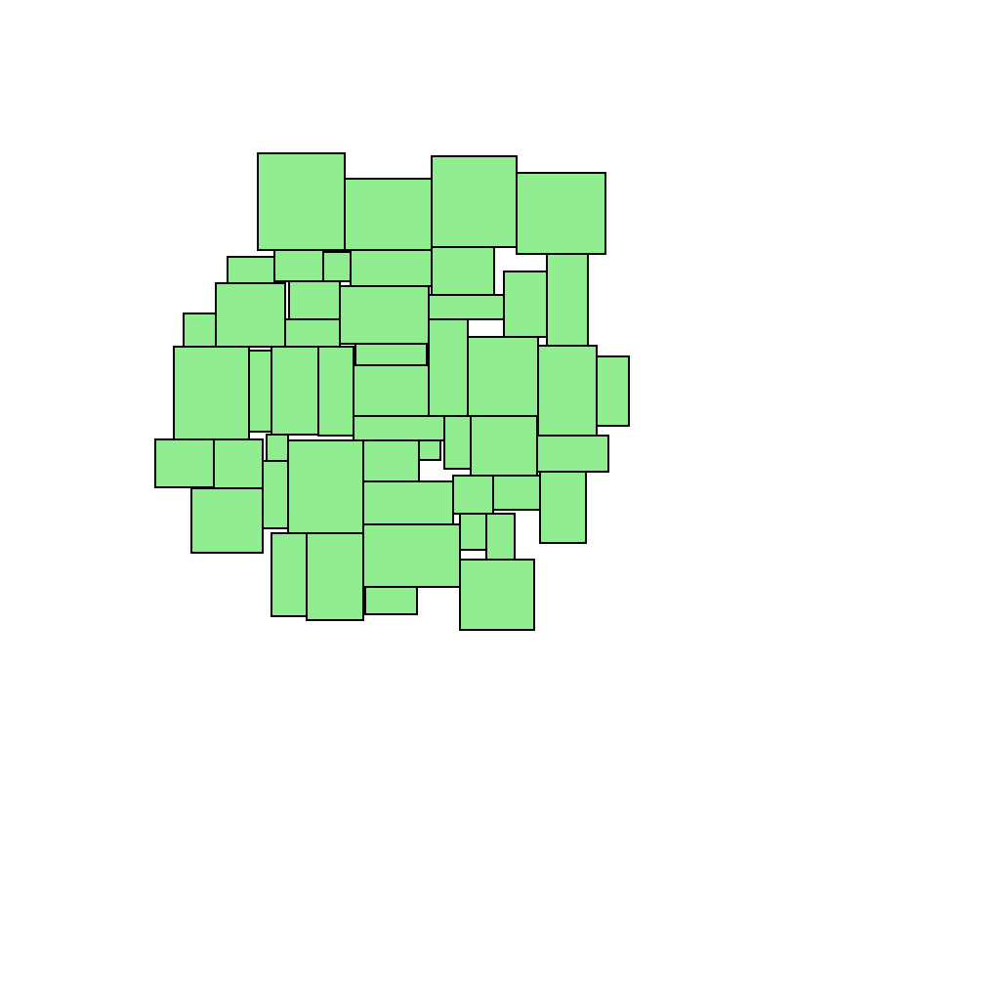

# ReadMe
здесь изложен алгоритм лежащий в основе работы класса CircularCloudLayouter

## Наблюдения

* Добавлять прямоугольник просто в пространство неоптимально, всегда можно сдвинуть его вплоть до первой границы имеющейся фигуры

* Оптимальное добавление при только одной касательной стороне возможно только если через центр прямоугольника проходит ось координат

###картинка поясняющая разметку прямоугольника

####Алгоритм

Из наблюдения 1 становится понятно что нас интересует именно граница уже имеющегося облака.
Мы храним все отрезки которые составляют границу уже собранного облака. 
При добавлении мы пытаемся присоединить к облаку новый прямоугольник по ребру, проверяя крайние положения.
Для случая когда сторона прямоугольника меньше отрезка:
Если через отрезок не проходит ось center граничное условие всегда оптимальнее чем присоединение посреди отрезка.
В противном случае наблюдение 2.
Для случая когда сторона прямоугольника больше отрезка:
Можно продлить отрезок в обе стороны до первого ограничивающего отрезка.
Если все еще сторона прямоугольника больше отрезка - continue.
Иначе граничные случаи.
После каждого добавления нового прямоугольника вызывается спец. метод удаляющий внутренние отрезки.

#####Флаги

Флаг SafeMode в Layouter включает SafeMode. В данном режиме перед отдачей прямоугольника в layouter прямоугольник проверяется на пересечение
с остальными прямоугольниками и если он пересекается то мы запускаем поиск снова исключая из поиска то ребро, к которому мы пытались присоединиться

Флаг TestMode в форме включает TestMode. В данном режиме мы при получении нового прямоугольника из layouter перед отрисовкой проверяем что он не 
пересекается с ранее добавленными и если это так то останавливаем выполнение и пишем в лог все добавленные прямоугольники

######Примеры

